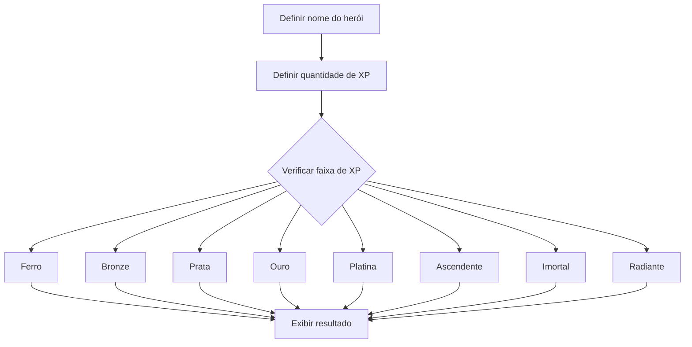

<div align="center">

# 🦸 Classificador de Nível de Herói

Desafio de lógica de programação desenvolvido em JavaScript para classificar o nível de um herói com base em sua quantidade de experiência.


</div>

---

## 📌 Sobre o projeto

Este projeto implementa um classificador de nível de herói utilizando JavaScript.

O programa armazena o nome e a quantidade de experiência, ou `XP`, de um personagem. Em seguida, utiliza estruturas condicionais para determinar em qual nível o herói se encontra.

Ao final da execução, é exibida uma mensagem com o nome e a classificação correspondente.

Exemplo:

```text
O herói de nome Artemis está no nível Platina
```

O projeto foi desenvolvido como parte de um desafio da **Digital Innovation One — DIO**, com foco nos fundamentos da lógica de programação.

---

## 🎯 Objetivos

Os principais objetivos deste desafio são:

* praticar a declaração de variáveis;
* utilizar operadores relacionais;
* utilizar operadores lógicos;
* compreender estruturas condicionais;
* trabalhar com intervalos numéricos;
* criar uma sequência de decisões;
* utilizar template strings;
* exibir resultados no terminal;
* desenvolver raciocínio lógico com JavaScript.

---

## 🧠 Regra de classificação

O nível do herói é determinado pela quantidade de experiência acumulada.

|          Experiência | Nível      |
| -------------------: | ---------- |
|         Até 1.000 XP | Ferro      |
|  De 1.001 a 2.000 XP | Bronze     |
|  De 2.001 a 5.000 XP | Prata      |
|  De 5.001 a 7.000 XP | Ouro       |
|  De 7.001 a 8.000 XP | Platina    |
|  De 8.001 a 9.000 XP | Ascendente |
| De 9.001 a 10.000 XP | Imortal    |
|   Acima de 10.000 XP | Radiante   |

---

## 🔄 Funcionamento

O fluxo do programa é:



Primeiro, são declaradas as variáveis:

```javascript
let nomeDoHeroi = "Artemis";
let experiencia = 7500;
let nivelDoHeroi = "";
```

Depois, uma estrutura condicional compara a experiência com as faixas definidas:

```javascript
if (experiencia <= 1000) {
    nivelDoHeroi = "Ferro";
} else if (experiencia <= 2000) {
    nivelDoHeroi = "Bronze";
} else if (experiencia <= 5000) {
    nivelDoHeroi = "Prata";
} else if (experiencia <= 7000) {
    nivelDoHeroi = "Ouro";
} else if (experiencia <= 8000) {
    nivelDoHeroi = "Platina";
} else if (experiencia <= 9000) {
    nivelDoHeroi = "Ascendente";
} else if (experiencia <= 10000) {
    nivelDoHeroi = "Imortal";
} else {
    nivelDoHeroi = "Radiante";
}
```

Por fim, o resultado é exibido com uma template string:

```javascript
console.log(
    `O herói de nome ${nomeDoHeroi} está no nível ${nivelDoHeroi}`
);
```

---

## 🛠️ Tecnologias utilizadas

| Tecnologia | Aplicação                        |
| ---------- | -------------------------------- |
| JavaScript | Implementação da lógica          |
| Node.js    | Execução do programa no terminal |
| Git        | Controle de versão               |
| GitHub     | Hospedagem e documentação        |
| VS Code    | Desenvolvimento do código        |

---

## 📁 Estrutura do repositório

```text
Desafio-Nvl-Heroi-DIO/
│
├── DesafioNvlHeroi.js
└── README.md
```

| Arquivo              | Descrição                         |
| -------------------- | --------------------------------- |
| `DesafioNvlHeroi.js` | Código principal do classificador |
| `README.md`          | Documentação do projeto           |

---

## 🚀 Como executar

### Pré-requisitos

Para executar o projeto, é necessário possuir:

* Git;
* Node.js;
* terminal ou Prompt de Comando;
* editor de código, opcionalmente.

### 1. Clone o repositório

```bash
git clone https://github.com/ONestoDev/Desafio-Nvl-Heroi-DIO.git
```

### 2. Acesse a pasta

```bash
cd Desafio-Nvl-Heroi-DIO
```

### 3. Execute o arquivo

```bash
node DesafioNvlHeroi.js
```

### 4. Confira o resultado

Com os valores atuais:

```javascript
let nomeDoHeroi = "Artemis";
let experiencia = 7500;
```

A saída será:

```text
O herói de nome Artemis está no nível Platina
```

---

## 🧪 Testando outros heróis

Para testar outro personagem, altere as variáveis:

```javascript
let nomeDoHeroi = "Kratos";
let experiencia = 12000;
```

Resultado esperado:

```text
O herói de nome Kratos está no nível Radiante
```

Outro exemplo:

```javascript
let nomeDoHeroi = "Luna";
let experiencia = 3500;
```

Resultado:

```text
O herói de nome Luna está no nível Prata
```

---

## 🧩 Conceitos praticados

### Variáveis

As variáveis armazenam os dados utilizados pelo programa:

```javascript
let nomeDoHeroi = "Artemis";
let experiencia = 7500;
```

### Operadores relacionais

São utilizados para comparar valores:

```javascript
experiencia <= 1000
experiencia > 10000
```

### Estruturas condicionais

Permitem escolher qual bloco será executado:

```javascript
if (condicao) {
    // Executado quando a condição é verdadeira
} else {
    // Executado quando a condição é falsa
}
```

### Template strings

Permitem inserir variáveis dentro de uma string:

```javascript
console.log(
    `O herói de nome ${nomeDoHeroi} está no nível ${nivelDoHeroi}`
);
```

---

## ✅ Exemplo completo

```javascript
const nomeDoHeroi = "Artemis";
const experiencia = 7500;

let nivelDoHeroi;

if (experiencia < 0 || !Number.isFinite(experiencia)) {
    nivelDoHeroi = "XP inválido";
} else if (experiencia <= 1000) {
    nivelDoHeroi = "Ferro";
} else if (experiencia <= 2000) {
    nivelDoHeroi = "Bronze";
} else if (experiencia <= 5000) {
    nivelDoHeroi = "Prata";
} else if (experiencia <= 7000) {
    nivelDoHeroi = "Ouro";
} else if (experiencia <= 8000) {
    nivelDoHeroi = "Platina";
} else if (experiencia <= 9000) {
    nivelDoHeroi = "Ascendente";
} else if (experiencia <= 10000) {
    nivelDoHeroi = "Imortal";
} else {
    nivelDoHeroi = "Radiante";
}

console.log(
    `O herói de nome ${nomeDoHeroi} está no nível ${nivelDoHeroi}`
);
```

---

## ⚠️ Limitações

A implementação atual possui finalidade educacional e apresenta algumas limitações:

* os dados são definidos diretamente no código;
* não existe entrada interativa;
* apenas um herói é classificado por execução;
* não há interface gráfica;
* não existem testes automatizados;
* não existe persistência de dados;
* a classificação não está isolada em uma função;
* entradas negativas precisam ser validadas explicitamente.

---

## 🗺️ Possíveis melhorias

O projeto poderá evoluir com:

* criação de uma função de classificação;
* entrada de dados pelo terminal;
* validação de valores negativos;
* classificação de vários heróis;
* armazenamento dos heróis em arrays;
* criação de testes automatizados;
* interface com HTML e CSS;
* formulário para nome e XP;
* histórico de classificações;
* ranking de personagens;
* separação entre regra de negócio e interface.

---

## 🧪 Evolução com função

A lógica pode ser extraída para uma função reutilizável:

```javascript
function classificarHeroi(experiencia) {
    if (!Number.isFinite(experiencia) || experiencia < 0) {
        throw new Error("A experiência deve ser um número não negativo.");
    }

    if (experiencia <= 1000) return "Ferro";
    if (experiencia <= 2000) return "Bronze";
    if (experiencia <= 5000) return "Prata";
    if (experiencia <= 7000) return "Ouro";
    if (experiencia <= 8000) return "Platina";
    if (experiencia <= 9000) return "Ascendente";
    if (experiencia <= 10000) return "Imortal";

    return "Radiante";
}

const nome = "Artemis";
const nivel = classificarHeroi(7500);

console.log(`O herói de nome ${nome} está no nível ${nivel}`);
```

Essa versão:

* evita repetição de condições;
* pode ser reutilizada;
* valida a entrada;
* facilita a criação de testes;
* separa a regra de classificação da saída.

---

## 📚 Aprendizados desenvolvidos

Durante o desafio foram praticados:

* sintaxe do JavaScript;
* declaração de variáveis;
* tipos primitivos;
* operadores relacionais;
* operadores lógicos;
* estruturas condicionais;
* intervalos numéricos;
* template strings;
* saída com `console.log`;
* execução com Node.js;
* lógica de programação.

---

## 🎓 Contexto educacional

Projeto desenvolvido durante o desafio **Classificador de Nível de Herói**, disponibilizado pela **Digital Innovation One — DIO**.

O repositório faz parte dos estudos iniciais de lógica de programação e JavaScript.

---

## 👨‍💻 Autor

Desenvolvido por **Ernesto — ONestoDev**.

[](https://github.com/ONestoDev)

---

## 📄 Licença

Este projeto possui finalidade educacional.

Os materiais e o enunciado original pertencem à instituição responsável pelo desafio.
